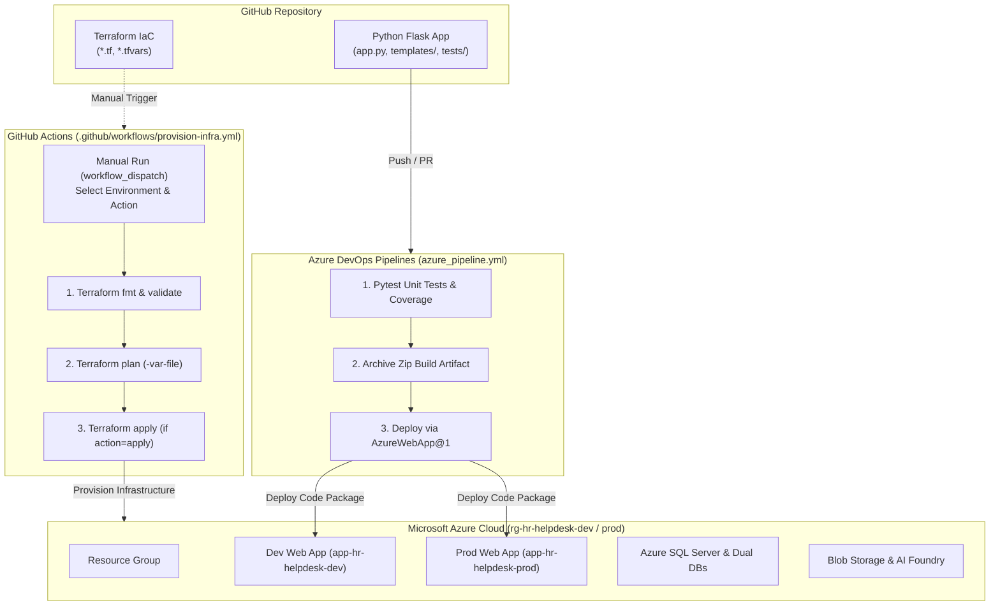

# Intelligent HR HelpDesk — Cloud Engineering & DevOps Architecture

> **DevOps Engineer**: Vignesh Srinivasan  
> **Architecture**: 3-Tier Client-Server-Database Cloud Architecture on Microsoft Azure  
> **Infrastructure as Code**: Terraform (Manual Provisioning via GitHub Actions `workflow_dispatch`)  
> **Application CI/CD Automation**: Multi-Stage Azure DevOps Pipelines (`azure_pipeline.yml`)

---

## 1. Overview & Cloud Architecture

The **Intelligent HR HelpDesk Platform** is designed as a secure, scalable 3-tier cloud application deployed on Azure. It automates employee workplace support through AI-powered ticket triage, sentiment analysis, policy RAG queries, and ticket summarization.

### Dual-Pipeline Hybrid Architecture Diagram



---

## 2. Infrastructure Provisioning (Manual via GitHub Actions)

Infrastructure provisioning is **strictly manual** to prevent accidental environment mutations. All Terraform actions must be explicitly triggered using **GitHub Actions `workflow_dispatch`**.

### Running Manual Provisioning

1. Go to your GitHub repository **Actions** tab.
2. Select the **`Provision Infrastructure (Terraform)`** workflow.
3. Click **Run workflow**.
4. Choose the target inputs:
   - **Target deployment environment**: `dev` or `prod`
   - **Terraform Action**: `plan` (preview changes) or `apply` (provision infrastructure)

### Required GitHub Secrets for Terraform Provisioning

Configure the following repository secrets in GitHub under **Settings > Secrets and variables > Actions**:

- `AZURE_CLIENT_ID`: Azure Service Principal Application (Client) ID
- `AZURE_CLIENT_SECRET`: Azure Service Principal Client Secret
- `AZURE_TENANT_ID`: Azure Directory (Tenant) ID
- `AZURE_SUBSCRIPTION_ID`: Azure Subscription ID
- `TF_VAR_SQL_ADMIN_PASSWORD`: Secure administrator password for Azure SQL Server

---

## 3. Application CI/CD (Azure DevOps Pipelines)

Application code compilation, unit testing, artifact packaging, and deployment to provisioned Azure Web Apps are automated via **Azure DevOps Pipelines** ([`azure_pipeline.yml`](file:///Users/vigneshsrinivasan/Desktop/Training/Cloud-Engineering/my-azure-testing-ground/azure_pipeline.yml)).

### Pipeline Stages

```
[ Git Push ] ──► STAGE 1: BuildAndTest
                    ├── Setup Python 3.12 & Install Pip Dependencies
                    ├── Execute Pytest Unit Tests & Publish XML Report
                    └── Archive & Publish App Zip Artifact (.zip)
                          │
          ┌───────────────┼───────────────┐
          ▼               ▼               ▼
    Branch: dev    Branch: testing   Branch: main
          │               │               │
   STAGE 2: Dev   STAGE 3: Testing STAGE 4: Prod
  (App Service Dev)(App Service Test)(App Service Prod)
```

### Azure DevOps Service Connection Setup

In Azure DevOps, configure an ARM Service Principal connection named **`Azure-AppService-Conn`**:
1. Navigate to **Project Settings > Service connections > New service connection**.
2. Select **Azure Resource Manager > Service principal (automatic/manual)**.
3. Grant access permissions to the target Azure Subscription and Resource Group (`rg-hr-helpdesk-dev` / `rg-hr-helpdesk-prod`).

---

## 4. Local Execution & Validation Commands

```bash
# 1. Local Python Unit Testing
pytest

# 2. Terraform Syntax Validation & Format Check
terraform fmt -check
terraform init -backend=false
terraform validate

# 3. Local Terraform Plan (Dev Environment)
terraform plan -var-file=dev.tfvars
```
