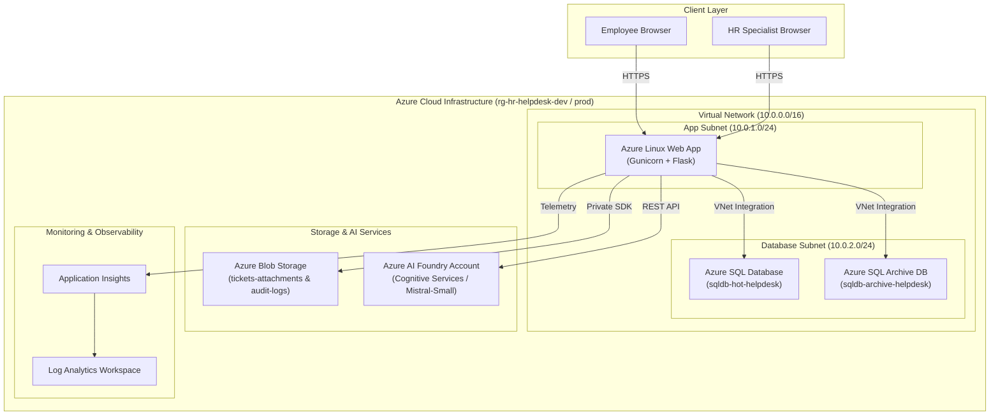

# Intelligent HR HelpDesk — Cloud Engineering & DevOps Architecture

> **DevOps Engineer**: Vignesh Srinivasan  
> **Architecture**: 3-Tier Client-Server-Database Cloud Architecture on Microsoft Azure  
> **Infrastructure as Code**: Terraform  
> **CI/CD Automation**: Multi-Stage Azure DevOps Pipelines (`azure_pipeline.yml`)

---

## 1. Overview & Cloud Architecture

The **Intelligent HR HelpDesk Platform** is designed as a secure, scalable 3-tier cloud application deployed on Azure. It automates employee workplace support through AI-powered ticket triage, sentiment analysis, policy RAG queries, and ticket summarization.

### 3-Tier Architecture Diagram



---

## 2. Infrastructure as Code (Terraform)

The entire infrastructure is declared using Terraform with modular variable files for environment isolation (`dev`, `prod`).

### Provisioned Azure Resources

| Resource | Terraform Name | Description |
|---|---|---|
| **Resource Group** | `azurerm_resource_group.rg` | Resource container (`rg-hr-helpdesk-dev`) |
| **Virtual Network** | `azurerm_virtual_network.vnet` | 3-tier VNet (`10.0.0.0/16` for Dev, `10.10.0.0/16` for Prod) |
| **App Subnet** | `azurerm_subnet.app_subnet` | Delegated subnet for App Service VNet Integration |
| **DB Subnet** | `azurerm_subnet.db_subnet` | Isolated database subnet with SQL service endpoint |
| **App Service Plan** | `azurerm_service_plan.asp` | Linux Service Plan (F1 Free / B1 Basic) |
| **Web App** | `azurerm_linux_web_app.app` | Linux Web App running Python 3.12 stack |
| **Azure SQL Server** | `azurerm_mssql_server.sql_server` | Managed SQL Server with TLS 1.2 enforced |
| **Hot Database** | `azurerm_mssql_database.sql_db_hot` | Active ticket database (`sqldb-hot-helpdesk`) |
| **Archive Database** | `azurerm_mssql_database.sql_db_archive` | Resolved ticket audit store (`sqldb-archive-helpdesk`) |
| **Storage Account** | `azurerm_storage_account.sa` | Blob storage for attachments and audit archives |
| **AI Foundry Account** | `azurerm_cognitive_account.ai_foundry` | Azure Cognitive Services AI Foundry model host |
| **Application Insights** | `azurerm_application_insights.app_insights` | Performance and error telemetry collector |
| **Log Analytics** | `azurerm_log_analytics_workspace.log_workspace` | Log retention and querying workspace |

### Infrastructure Commands

```bash
# 1. Initialize backend state and providers
terraform init

# 2. Check formatting
terraform fmt -check

# 3. Validate syntax
terraform validate

# 4. Generate deployment execution plan (Dev)
terraform plan -var-file=dev.tfvars

# 5. Apply infrastructure (Dev)
terraform apply -var-file=dev.tfvars -auto-approve
```

---

## 3. Multi-Stage CI/CD Azure DevOps Pipeline

The automated deployment pipeline is configured in [`azure_pipeline.yml`](file:///Users/vigneshsrinivasan/Desktop/Training/Cloud-Engineering/my-azure-testing-ground/azure_pipeline.yml).

### Pipeline Stages & Triggers

```
[ Git Push ] ──► STAGE 1: BuildTestValidate
                    ├── Python 3.12 Setup & Pip Dependencies
                    ├── Pytest Unit Tests Execution
                    ├── Terraform Format & Syntax Validation
                    └── Publish Build Artifact (.zip)
                          │
         ┌────────────────┼────────────────┐
         ▼                ▼                ▼
   Branch: dev     Branch: testing    Branch: main
         │                │                │
  STAGE 2: Dev    STAGE 3: Testing  STAGE 4: Prod
 (App Service Dev) (App Service Test) (App Service Prod)
```

---

## 4. Environment Variables Matrix

The application picks up connection credentials dynamically via environment variables. Refer to [`.env.example`](file:///Users/vigneshsrinivasan/Desktop/Training/Cloud-Engineering/my-azure-testing-ground/.env.example) for local settings.

| Setting | Purpose | Secret? |
|---|---|---|
| `AZURE_SQL_HOST` | Fully Qualified Domain Name of Azure SQL Server | No |
| `AZURE_SQL_HOT_DB` | Primary Hot Database name | No |
| `AZURE_SQL_ARCHIVE_DB` | Cold Archive Database name | No |
| `AZURE_STORAGE_ACCOUNT` | Blob storage account name | No |
| `AZURE_AI_ENDPOINT` | Azure AI Foundry / Cognitive Endpoint | No |
| `AZURE_AI_API_KEY` | Azure AI Foundry API key | **Yes** |
| `AZURE_AI_MODEL` | AI Model deployment name (`mistral-small-2503`) | No |
| `APPINSIGHTS_INSTRUMENTATIONKEY` | Application Insights key | **Yes** |

---

## 5. Maintenance & Observability Plan

1. **System Health & Alerting**: Application Insights monitors response latency, 5xx server errors, and SLA breaches.
2. **Database Backup & Retention**: Azure SQL automated daily backups with retention in `sqldb-archive-helpdesk`.
3. **Security & VNet Isolation**: VNet Integration forces backend data access strictly through App Subnet to DB Subnet.
